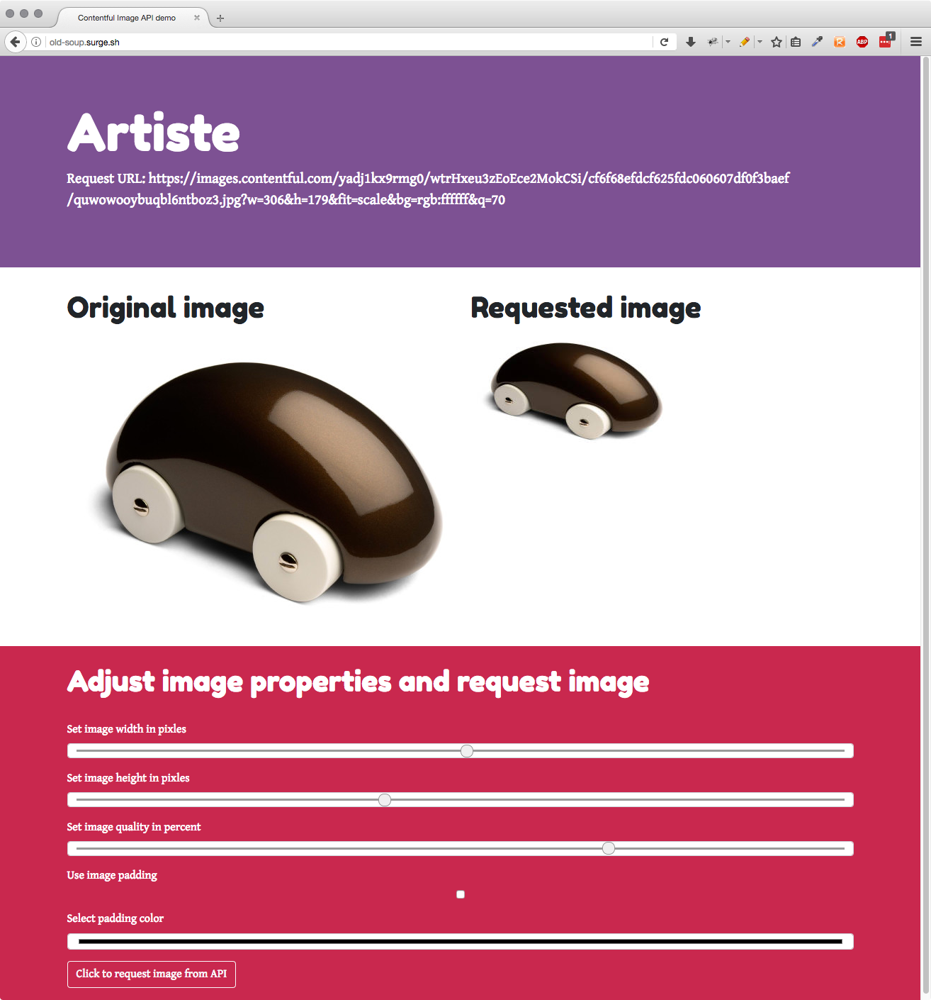

# ARTISTE
Artiste is a small demo implementation of the [Contentful image API](https://www.contentful.com/developers/docs/references/images-api/).

A live demo is available at [http://magnificent-system.surge.sh/](http://magnificent-system.surge.sh/)

## HOW DOES IT WORK
The Contentful image API lets you manipulate images on the fly using API calls

Let's say you have the following image stored with Contentful:

To request this you simply request the following url: `https://images.contentful.com/yadj1kx9rmg0/wtrHxeu3zEoEce2MokCSi/cf6f68efdcf625fdc060607df0f3baef/quwowooybuqbl6ntboz3.jpg`

And if you want to use the Image API's support for image resizing and JPEG quality you can append one of the following parameters  to the URL:

* `w` — Sets the requested width
* `h` — Sets the requested height
* `q` — Sets the requested JPEG image quality

### Example request

Example request where width is set to 349, height to 254 and the JPEG quality to 70

`https://images.contentful.com/yadj1kx9rmg0/wtrHxeu3zEoEce2MokCSi/cf6f68efdcf625fdc060607df0f3baef/quwowooybuqbl6ntboz3.jpg?w=349&h=254&fit=scale&q=70`

## GUI screenshot

